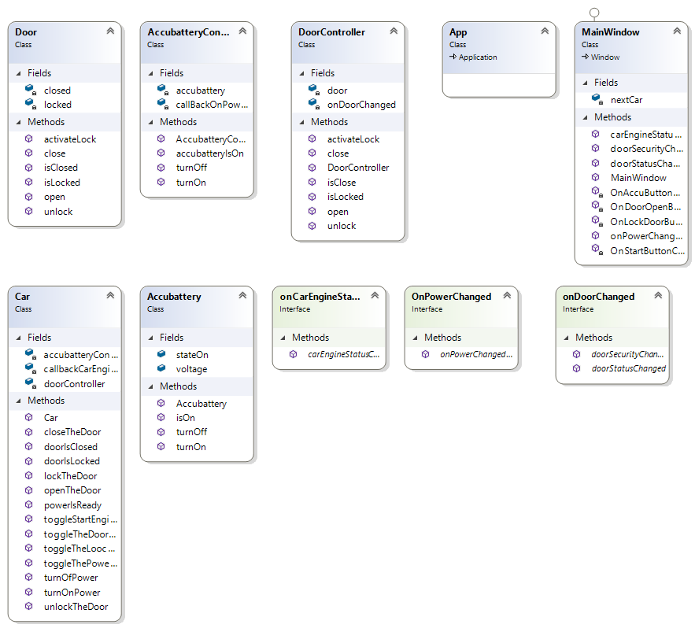

## TheNextCar
Aplikasi dengan penerapan MVC
## Features
- User dapat mengklik button yang tersedia
- Button start akan berjalan ketika pintu tertutup,terkunci dan aki dinyalakan
- Jilka salah satu persyarat tidak terpenuhi maka ketika klik button start akan muncul informasi dari syarat yang tidak terpenuhi
## Tugas
- Class Diagram:

- DoorController yang berfungsi mengatur button DoorOpenButton
- Model Door.cs berguna untuk menampilkan data DoorOpenState sesuai tombol inputan
- interface  OnDoorChanged berfungsi sebagai pengambil data pada LockDoorState.Content dan LockDoorButton.Content

